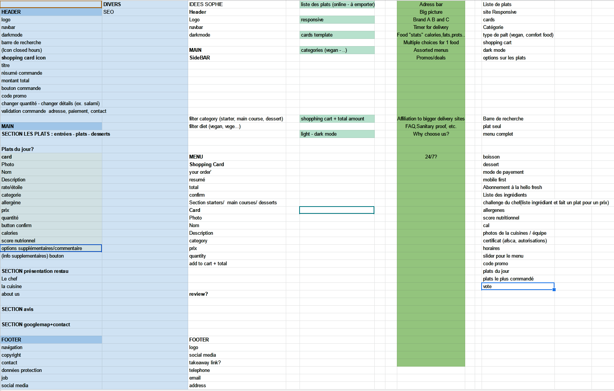
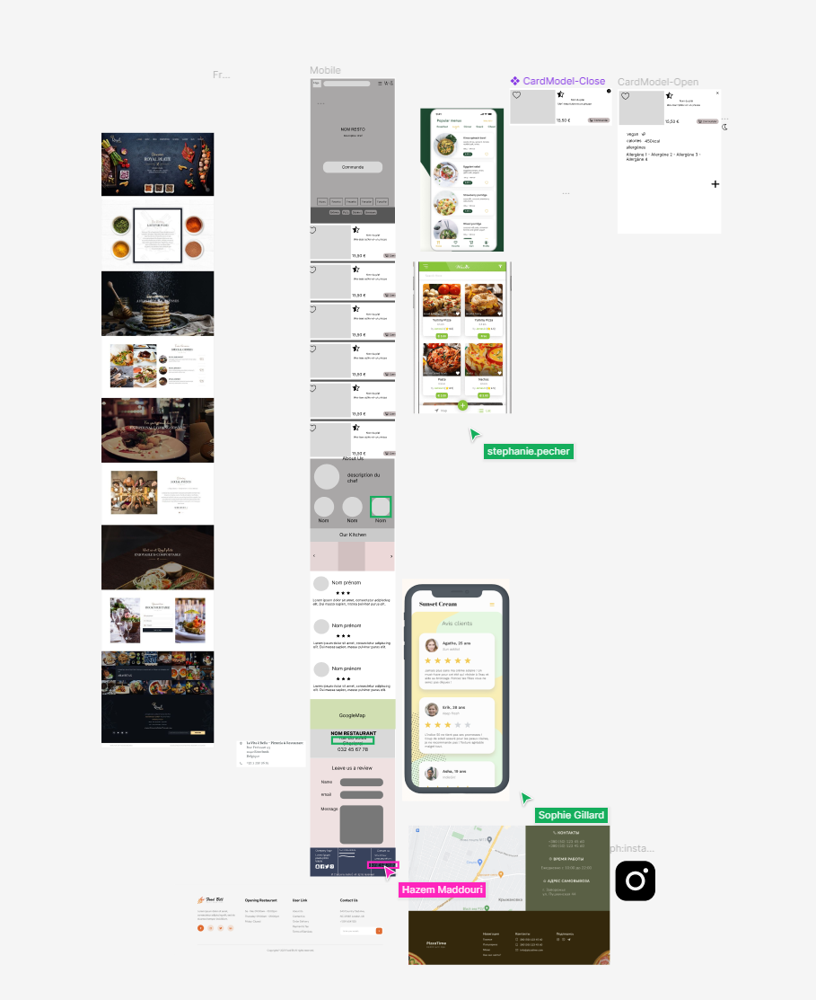

# Project Dark Kitchen

## Team

- Xavier C.
- Sophie G.
- Hazem M.
- Stéphanie P.

## Organisation du projet

### Phase 1 - Brainstorming

Réalisation d'un Brainstorming en team afin de trouver des idées de fonctionnalités et de design.

### Phase 2 - WireFrame

Sur base des idées du brainstorming, nous avons réalisé le wireframe en se basant sur le mobile-first

### Phase 3 - Maquette

Réalisation du design de la maquette en se basant sur les wireframes

### Phase 4 - Création du workspace

- Création du repo
- Structure des dossiers

### Phase 5 - Description fonctionnelles des blocks

Pour chaque sections, chaque éléments doit avoir une description fonctionnelle afin que celui qui bosse dessus puisse exactement faire ce que l'on demande

### Phase 6 - CODE CODE CODE

#### Structure HTML

Les balises adéquates doivent être utilisée.
N'utiliser de div que pour groupé des éléments. Chaque contenu pertinant à sa balise html

#### Style

- Commencer par les plus petits éléments qui seront utilisés partout sur le site.
  Ces éléments pourront ainsi être repris dans de plus complexes
- BEM
- Des que de données devront se répéter à plusieur endroits (ex couleurs) utiliser une variable SCSS
- Utiliser la Mixin pour la version Desktop
- utiliser des modules en JS pour séparer les codes.

#### JS

Utiliser au maximum les fonctions et gerer les modules

### SCSS

#### Commande SASS pour compiler les fichiers SCSS

sass ./assets/scss/main.scss:./assets/css/style.css --watch

BASE : Style de base commun à tous le site
ELEMENTS : Ensemble des éléments de bases du site et des composants
COMPOSANTS : Les composants sont des blocs constitués d'autres composants plus petits ou d'éléménts
UTILS : Contient les fichiers utilitaires
VENDORS : contient du css ()

[Plus d'infos](https://openclassrooms.com/fr/courses/6106181-simplifiez-vous-le-css-avec-sass/6599201-utilisez-le-systeme-7-1-pour-une-codebase-plus-simple-a-gerer)

#### BEM

block\_\_element--modifier

.cardsList{

    &__card{  =>cardsList__card

        &__title{ => cardsList__card__title

        }

        &__card--promo => cardsList__card--promo
    }

}

### GIT

- La branch MAIN ne sert que pour des versions validées par tous et testées
- Décomposer son travail en étapes simples et à chaque fois créér une branche
- Des soucis de versions arriveront. Il va falloir apprendre à les gerer.

### Commandes

- git branch nomDeBranch
- git checkout nomDeBranch
- git checkout -b nomDeBranch (pour créer et aller dans la nouvelle branche)
- git add \*
- git commit -m "Un message pour que la team comprenne ce qui à été envoyé"
- git merge (se placer dans le dossier qui doit recevoir l'autre avant de merge)
- git push
